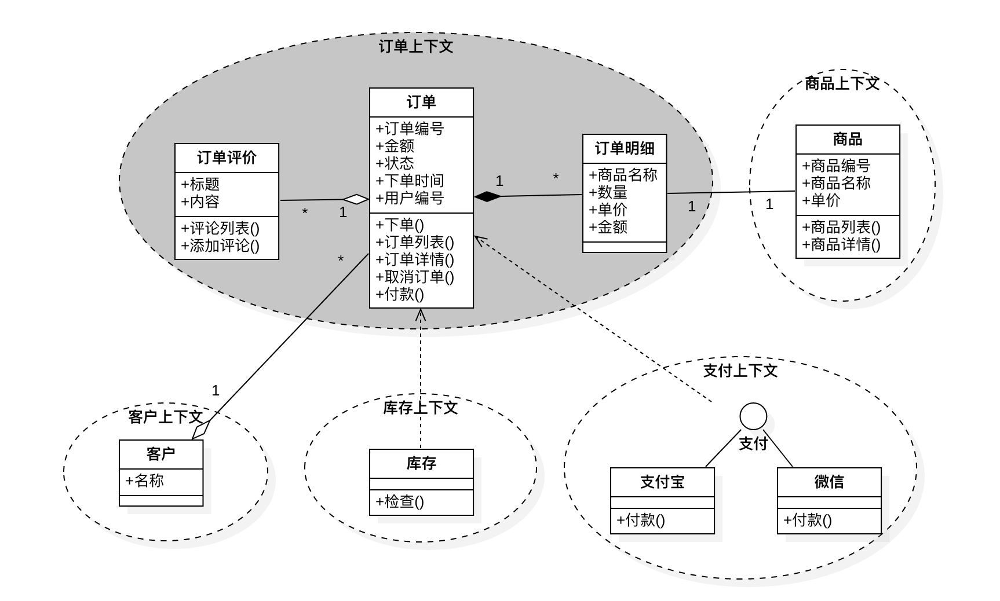

# cola-dddd-scaffold

### 建模案例

### 需求

实现订单上下文。

### DDD战术

### 方法论

* 最中心的红色多边形Application Core即表示业务逻辑实现，即应用核心
    * 红色多边形的边界即表示端口Port，即应用核心的入口/出口定义
    * Application Layer - 应用层，包括：
        * Application Services，业务用例的编排服务即及其interface定义，应用服务的作用通常如下：
            * 使用 Repository 查找一个或多个实体；
            * 让这些实体执行一些领域逻辑；
            * 再次使用 Repository 让这些实体持久化，有效地保存数据变化；
            * 触发应用事件（如发送邮件、调用第三方API、发送MQ消息等）。
            * CQRS命令/查询处理器
            * Event Listener事件监听器
            * Port端口定义，如ORM 接口Repository、搜索引擎接口、消息接口等等
    * Domain Layer - 领域层，这一层含了数据和操作数据的逻辑，它们只和领域本身有关，独立于调用这些逻辑的业务过程。它们完全独立，对应用层完全无感知。
        * Domain Services - 领域服务，封装涉及多实体（相同或不同实体类型）的领域逻辑，且领域服务间可以相互调用。
        * Domain Models - 领域模型，在架构的正中心，完全不依赖外部任何层次的领域模型。它包含了那些表示领域中某个概念的业务对象，如实体、值对象、枚举以及其它领域模型种用到的任何对象（如领域事件Domain Events，简单理解为MQ消息）。
* 红色多边形的外侧左半圆部分即为主/主动适配器（用户界面User Interface实现）
    * 如Spring MVC中的Controller实现
    * Command Query Bus 命令查询总线
* 红色多边形的外侧右半圆部分即次/被动适配器（基础设置Infrastructure实现）
    * 如数据持久化实现Mysql、短信通知实现、MQ通知、搜索引擎ES实现等
    * Event Bus 事件总线
* 依赖方向由外到内，且内层不知道外层（参见之前洋葱架构）

包结构及用途:

1. adapter.<aggregate-name>.web: RESTful API.
2. application.<aggregate-name>.executor: 应用服务.
3. domain.<aggregate-name>.model: 实体、值对象.
4. domain.<aggregate-name>.ability: 领域服务.
5. domain.<aggregate-name>.gateway: 领域网关.
6. infrastructure.<aggregate-name>.gatewayimpl: 网关实现.
7. infrastructure.<aggregate-name>.mapper: myBatis数据库映射.
8. infrastructure.<aggregate-name>.config: 配置信息.

概念解释:

1. 应用服务（Application Service）：组织业务场景，编排业务，隔离场景对领域层的差异。不提供领域实现，也不包含业务逻辑。粒度较粗，不能被复用。
2. 领域服务（Domain Service）：多个聚合的协作，目的是使用聚合内的实体和值对象编排业务逻辑。粒度较细，便于复用。为了更少的领域逻辑被分散到领域服务，强制在领域服务命名时加上动词。
3. 领域对象（Domain Model）：实现具体的业务逻辑、规则，为应用层提供无差别的服务能力。
4. 基础设施（Infrastructure）：提供具体的技术实现，比如数据库存储、缓存、消息，基础设施对业务保持透明。
5. 聚合（Aggregate）：是一组生命周期强一致，修改规则强关联的实体和值对象的集合，表达统一的业务意义。
6. 聚合根（ Aggregate Root）：是聚合中最核心的实体，其他的实体和值对象都从属于这个实体。
7. 仓储（Repository）：是以持久化领域模型为职责的类，只有聚合根才能拥有Repository，Repository管理领域对象的生命周期并屏蔽数据库的实现。
8. 工厂（Factory）：是以构建领域模型（实体或值对象）为职责的类或方法。负责聚合实例的生，垃圾回收负责聚合实例的死。
